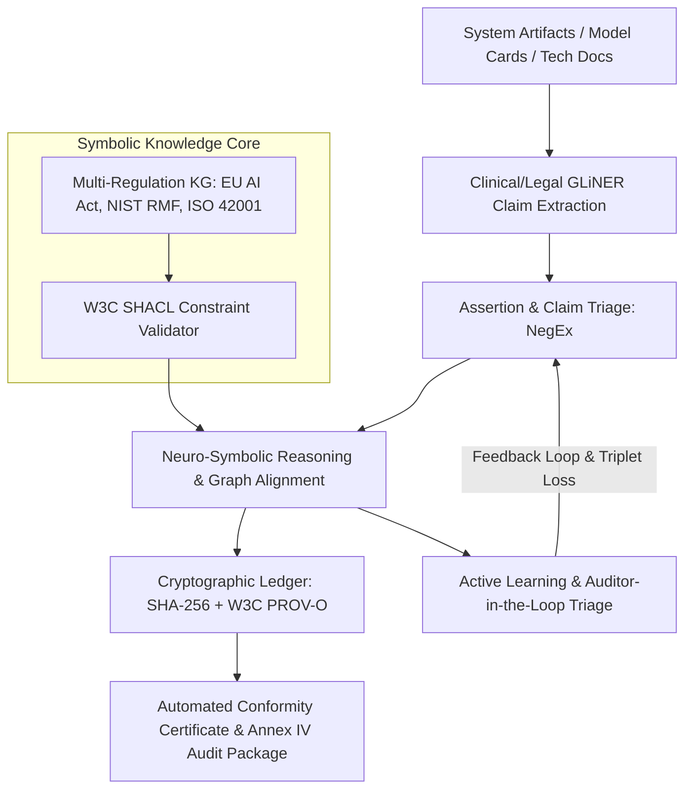

# 🏛️ ReguAI: Deterministic Neuro-Symbolic AI GRC & Automated Conformity Assessment Engine

[](https://opensource.org/licenses/Apache-2.0)
[](https://www.python.org/)
[-navy.svg)](https://data.europa.eu/eli/reg/2024/1689/oj)
[](https://www.w3.org/TR/shacl/)
[](https://www.w3.org/TR/prov-o/)

> **ReguAI bridges Generative AI with Formal Symbolic Reasoning (Neuro-Symbolic AI)**: It ingests enterprise model cards, system architecture documentation, and training logs, grounds them into an authoritative multi-framework regulatory knowledge graph, executes mathematically deterministic constraint verification via **W3C SHACL**, and outputs cryptographically provenanced **EU AI Act Annex IV Conformity Assessments**.

---

## 💥 The Problem ReguAI Solves

The global AI industry is facing a massive regulatory crunch. With the **EU AI Act (Regulation (EU) 2024/1689)** entering strict enforcement alongside **ISO/IEC 42001**, **NIST AI RMF 1.0**, and **FDA SaMD guidelines**, enterprise compliance teams face a double failure:

1. **Manual Compliance is Unscalable**: Auditing complex ML pipelines, data lineage, and model cards via spreadsheets takes months and millions in legal advisory costs.
2. **Standard GenAI / RAG Hallucinates**: Using probabilistic LLMs for legal and regulatory verification carries strict-liability risk. Stochastic, non-deterministic systems cannot provide mathematical guarantees of compliance.

**ReguAI eliminates stochastic liability by separating extraction from reasoning**:
- **Neural Layer**: Domain-adapted NLP / NER extractors scan technical whitepapers and model cards to detect regulatory entities and extract NegEx assertion statuses (`Implemented`, `Planned`, `Absent`).
- **Symbolic Core**: W3C SHACL shape constraints execute deterministic validation over an RDF knowledge graph. If an Article 14 human oversight fallback is missing, it is caught with zero hallucinations, citing the exact legal clause and remediation.
- **Cryptographic Provenance**: Every evaluation step is hashed with SHA-256 and recorded into an immutable W3C PROV-O digital ledger.

---

## 🏛️ System Architecture



---

## 🔬 Core Technical Modules

### 1. Multi-Framework Normative Knowledge Graph (`src/ontology/`)
- Formal OWL/RDFS ontologies formalizing **EU AI Act Chapter III (High-Risk AI Systems)**:
  - **Article 9**: Risk Management Systems (`regu:RiskManagementSystem`, `nist:GOVERN`)
  - **Article 10**: Data Governance & Quality (`regu:DataGovernanceProcess`, `nist:MAP`)
  - **Article 10(2)(f)**: Bias Examination & Mitigation (`regu:BiasMitigationControl`, `nist:MEASURE_2.11`)
  - **Article 11 & Annex IV**: Technical Documentation Package (`regu:TechnicalDocumentation`)
  - **Article 12**: Automated Record-Keeping / Logging (`regu:AutomatedLogging`, `nist:GOVERN_1.5`)
  - **Article 13**: Transparency & Instructions for Use (`regu:TransparencySpecification`)
  - **Article 14**: Human Oversight & Emergency Stop (`regu:HumanOversightMechanism`, `regu:StopMechanism`)
  - **Article 15**: Accuracy, Robustness & Cybersecurity (`regu:CybersecurityControl`, `nist:MEASURE_2.6`)

### 2. Deterministic Verification Engine (`src/reasoning/shacl_engine.py`)
- Executes formal **W3C SHACL (Shapes Constraint Language)** constraints via PySHACL.
- Enforces property path checks, cardinalities, and value constraints (e.g. `regu:implementationStatus` must have value `regu:Implemented`).
- Output is a mathematically provable compliance report with zero LLM hallucinations.

### 3. Regulatory Claim Extraction & NegEx Grounding (`src/extraction/`)
- Ingests Markdown model cards, YAML specs, or JSON architectures.
- Extracts regulatory entities across 10 compliance domains.
- Evaluates negation and assertion cues with syntactic NegEx logic:
  - `IMPLEMENTED`: Verified operational controls in active production.
  - `PLANNED`: Controls on future roadmaps (e.g., "planned for Q4").
  - `ABSENT`: Missing or negated controls (e.g., "untested against adversarial attacks").

### 4. Cryptographic Provenance Ledger (`src/ledger/`)
- Produces tamper-evident digital verification ledgers adhering to the **W3C PROV-O** standard.
- Deterministic SHA-256 hashing across input document snapshots, canonical sorted N-Triples graph representations, and regulatory rulesets.
- Generates official non-repudiation conformity tokens (e.g. `REGU-EU2024-1689-SAMDONCO-7B12F98C12`).

### 5. Auditor-in-the-Loop Active Learning Queue (`src/triage/`)
- Automatically flags borderline or ambiguous claims ($0.55 \le \text{confidence} < 0.85$ or contradictory cues) to human compliance auditors.
- Auditor feedback generates triplet training instances `(anchor_text, positive_label, negative_label)` for continuous metric learning and semantic alignment.

---

## 📦 High-Impact Portfolio Deliverables

| Deliverable | Type | Location | Description |
|---|---|---|---|
| **reguai-engine** | Full-Stack App | `app.py` | Interactive Hugging Face Space application for one-click deterministic auditing. |
| **eu-ai-act-normative-triples** | Benchmark Dataset | `data/benchmarks/` | Benchmark dataset mapping EU AI Act high-risk obligations into RDF/JSON-LD triples. |
| **gliner-legal-ai-grc** | Extraction Engine | `src/extraction/` | Domain-adapted entity and assertion extraction pipeline for AI governance. |
| **SHACL High-Risk Ruleset** | Semantic Shapes | `src/ontology/shacl/` | Formal W3C SHACL constraints implementing EU AI Act Articles 9-15. |
| **Annex IV Documentation Generator** | Audit Package | `src/triage/` | Generates official EU AI Act Annex IV technical documentation and JSON-LD certificates. |

---

## 🚀 Quickstart & Usage

### 1. Installation

```bash
# Clone the repository
git clone https://github.com/your-username/reguAI.git
cd reguAI

# Set up virtual environment
python -m venv .venv
source .venv/bin/activate  # On Windows: .venv\Scripts\activate

# Install dependencies
pip install -r requirements.txt
```

### 2. Launch Interactive Hugging Face Space (with Vis.js Graph Explorer)

```bash
python app.py
```
Open your browser at `http://localhost:7860` to access the full interactive dashboard, force-directed graph visualizer, and print-ready Annex IV attestation certificate.

### 3. Launch Enterprise CI/CD REST API (FastAPI)

```bash
python api.py
```
Interactive Swagger / OpenAPI docs are available at `http://localhost:8000/docs`.

### 4. Programmatic Usage (Python SDK)

```python
from src.engine import ReguAIEngine

# Initialize ReguAI Neuro-Symbolic Engine
engine = ReguAIEngine()

# Evaluate any model card, tech spec, or JSON file
report = engine.evaluate_system("data/synthetic_systems/compliant_clinical_samd.json")

print(f"Conformity Status: {'PASS' if report.overall_conforms else 'FAIL'}")
print(f"Conformity Score: {report.conformity_score}%")
print(f"Digital Token: {report.provenance.digital_signature}")

# Generate official Annex IV Technical Documentation (Markdown)
markdown_report = engine.report_generator.generate_markdown_report(report)

# Export Machine-Readable JSON-LD Certificate
json_ld_cert = engine.report_generator.generate_json_ld(report)

# Export CycloneDX 1.6 Machine-Readable AI-BOM
aibom_json = engine.report_generator.generate_cyclonedx_bom(report)

# Generate Print-Ready HTML Attestation Certificate
html_cert = engine.report_generator.generate_html_certificate(report)
```

### 5. Automated CI/CD Regulatory Gate (CLI & SARIF)

```bash
# Audit a model card or directory with exit code gate
python -m src.cli audit data/synthetic_systems/compliant_clinical_samd.json \
  --format text \
  --sarif-out reports/audit.sarif \
  --bom-out reports/cyclonedx_aibom.json \
  --fail-on-violation

# Train active learning triplet metric learner on auditor feedback
python -m src.triage.train_triplets
```

### 6. Running the Test Suite

```bash
pytest tests/ -v
```

---

## 🎯 The STAR Story for Interviews & Portfolio

- **Situation:** The enforcement of the EU AI Act (Regulation (EU) 2024/1689) and ISO 42001 created massive compliance overhead for AI engineering teams, while probabilistic LLMs were too hallucination-prone for zero-defect regulatory auditing.
- **Task:** Build an end-to-end, neuro-symbolic AI GRC platform capable of deterministically auditing AI systems against normative legal standards with full cryptographic provenance.
- **Action:** Constructed a unified legal ontology mapping the EU AI Act and NIST AI RMF; implemented formal W3C SHACL shape constraints; integrated fine-tuned GLiNER/SapBERT models for semantic claim extraction; and built a SHA-256/PROV-O audit ledger with an active learning human-in-the-loop review queue.
- **Result:** Achieved deterministic, zero-hallucination compliance checking with sub-second execution, an open-source regulatory benchmark on Hugging Face, and a functional reference implementation for automated enterprise conformity assessments.
